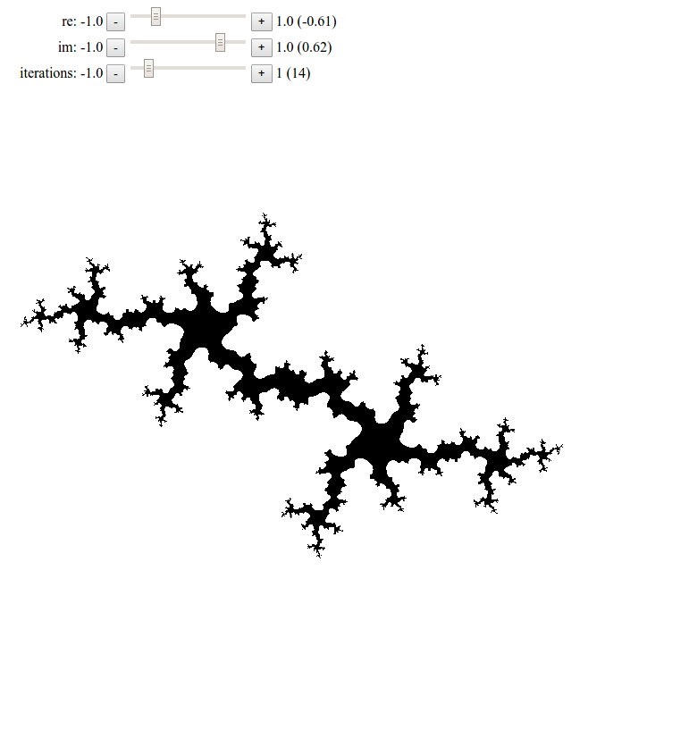

# Drawing Julia sets with Javascript
This was a simple approach to draw fractal structures with Javascript and
the 2D context.

Turned out that this is possible but not very quick. Better use WebGL/GLSL
and hardware acceleration for tasks like this.

### Note
There a WebGL implementation for this at https://www.int2byte.de/public/webgl_playground/05_fractal_test/main.html

The source for that is here https://github.com/IkarosKappler/webgl_playground/tree/master/05_fractal_test

